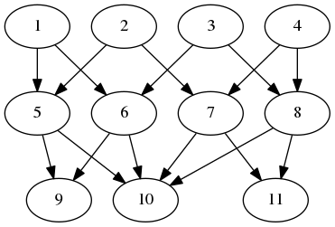

# The Posets package

### Package under development

* Website: https://github.com/isadofschi/posets
* Documentation: http://mate.dm.uba.ar/~isadofschi/posets
* Repository: https://github.com/isadofschi/posets

Posets and finite spaces

Start GAP and type

	LoadPackage("posets");

to load the package.

For details on how to use the Posets package see the package
documentation in the `doc` subdirectory (view its HTML version or 
`manual.pdf`  via a PDF viewer).
